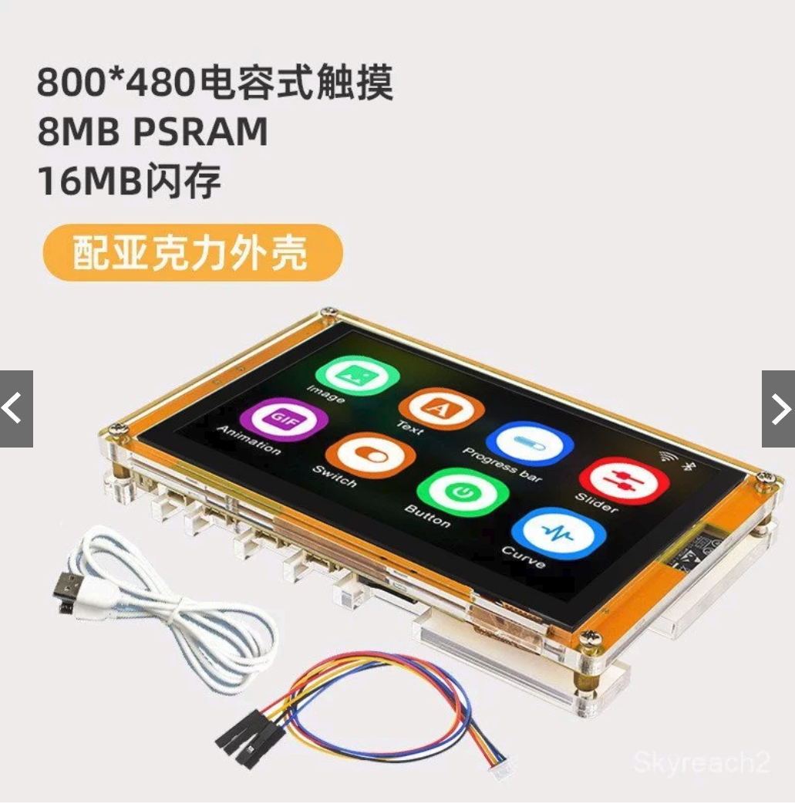

# touch-deck

This is a not yet implemented set of ideas:

* An open-source multitouch USB/BT touchpad (for use with PC)
* A cheap graphical screen (devboard is only about $40)
* Provide [Stream-controller](https://streamcontroller.github.io/docs/latest/) compatible API so that a graphical button array can be selected instead of touchpad
* When used as a touchpad provide cute water droplet or some sort of other touch/grab/gesture visualization

## Possible hardware 

(the last one - 7" with built in case seems ideal):

* https://www.aliexpress.us/item/3256808357526751.html
* https://shopee.tw/ESP32-P4-WIFI6-7%E8%8B%B1%E5%AF%B8%E4%BA%94%E9%BB%9E%E8%A7%B8%E6%8E%A7%E5%B1%8F%E9%96%8B%E7%99%BC%E6%9D%BF-1024%C3%97600%E5%88%86%E8%BE%A8%E7%8E%87-%E5%9F%BA%E6%96%BCESP32-P4%E5%92%8CESP32-C6-%E6%94%AF-i.871575797.40371503863
* https://shopee.tw/ESP32-S34.3%E5%AF%B85%E5%AF%B8LCD%E9%9B%BB%E5%AE%B9%E8%A7%B8%E6%91%B8%E5%B1%8FLVGL%E9%96%8B%E7%99%BC%E6%9D%BFIO%E6%93%B4%E5%B1%95-i.1578084179.44557771187?extraParams=%7B%22display_model_id%22%3A410687861211%2C%22model_selection_logic%22%3A3%7D&sp_atk=b636f0bc-1d2e-4669-8e72-0a2a2fb56695&xptdk=b636f0bc-1d2e-4669-8e72-0a2a2fb56695
* https://shopee.tw/-ESP32%E9%96%8B%E7%99%BC%E6%9D%BFWiFi%E8%97%8D%E7%89%992.8%E5%AF%B8240*320%E6%99%BA%E8%83%BD%E9%A1%AF%E7%A4%BA%E5%B1%8FTFT%E6%A8%A1%E5%A1%8A%E8%A7%B8%E6%91%B8%E8%9E%A2%E5%B9%95LVGL-i.265939604.43270466926?extraParams=%7B%22display_model_id%22%3A177318412563%2C%22model_selection_logic%22%3A3%7D&sp_atk=e2aa9b15-00cf-4c73-a053-7c6069bfe820&xptdk=e2aa9b15-00cf-4c73-a053-7c6069bfe820
* https://shopee.tw/ESP32-S3%E9%96%8B%E7%99%BC%E6%9D%BF%E5%B8%B65%E5%AF%B87%E5%AF%B8LCD%E5%9C%96%E5%BD%A2%E9%A1%AF%E7%A4%BA%E5%B1%8F%E9%9B%BB%E5%AE%B9%E5%B1%8FwifiMCU%E7%89%A9%E8%81%AF%E7%B6%B2-i.1725679736.56706409304

## Doc links

* [platform io config](https://community.home-assistant.io/t/esp32-8048s050-sunton-5-0-cyd-config/782740) - seems to use gt911 touch controller which seems quite nice
* [general info](https://www.espboards.dev/esp32/cyd-esp32-8048s050/) on these boards
* [great platform io repo](https://github.com/rzeldent/platformio-espressif32-sunton)

## Existing projects

FreeTouchDeck - code seems a bit yucky and limited to just a button array, possibly not reuse...
* Does the button portion already?  semi abandoned?  https://github.com/DustinWatts/FreeTouchDeck https://hackaday.io/project/175827/instructions 
* Newer platformio version of that project: https://github.com/dejavu1987/FreeTouchDeck 
* This old abandoned helper app: https://github.com/DustinWatts/FreeTouchDeck-Helper 
