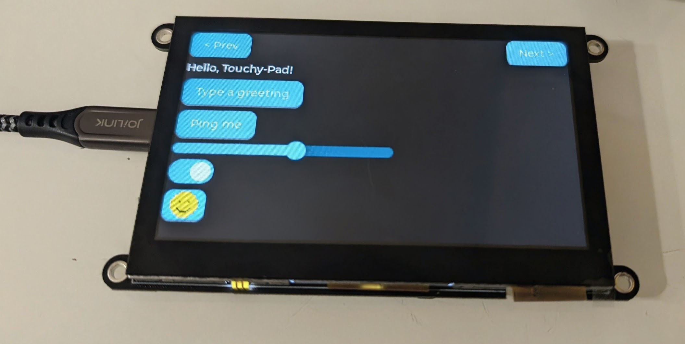

# Touchy-pad
[](https://github.com/geeksville/touchy-pad/actions/workflows/app-ci.yml)

Touchy-pad is an open-source app that turns various cheap ($15-$30) 'aliexpress' displays into:
* A high end graphical USB HID touchpad, with multitouch gestures, scrolling, dragging, keyboard macros, etc...
* A 'StreamDeck' like graphical macropad via an [OpenDeck](https://github.com/nekename/OpenDeck) plugin.
* A tool to allow you to run your own custom python (or other language) code on your PC, but attached to cheap-embeddable LCD panels (with no embedded programming required)

Read on for more info...


To see (and hear) a video demo click this:
[](https://youtu.be/-RXaUL3E1Vk)

If you have Python installed and a [suitable $15ish device](docs/hardware.md#jc4827w543), you can have this running on your hardware in less than a minute:
```bash
pip install touchy-pad
touchy update # This will automatically install the firmware on your board - prompting you as needed
```
More installation instructions [here](docs/installing.md).

## Current features


Disclaimer: This project is young, but moving at a fast pace.  You can already use it for a variety of cool things:

* It is a "premium feel" open-source multitouch USB touchpad with built-in customizable screen (for use with Mac/Linux/Windows/Android).  This works even if you don't want to run our sister app.
* Works with numerous cheap ESP32 based display boards ($15-$30 USD depending on features) - no soldering required, just connect USB, run the installer and go. The automated installer provides 'one-click' install for boards you purchased from wherever.
* When used as a touchpad provides a pretty water droplet touch/grab/turn/gesture visualization.
* Allows simple key/mouse shortcut/macros without the need for leaving the (optional) sister app running.  Generated entirely natively as USB events from our device.
* Also works like a "StreamDeck" via the [OpenDeck](https://github.com/nekename/OpenDeck) application.  Many different plugins automatically supported, bind behaviors and displays to your touchy-deck with a polished GUI app.
* Linux, macOS and Windows hosts are supported (in theory - currently only tested with Linux, please open a [GitHub issue](https://github.com/geeksville/touchy-pad/issues) if you see problems on your machine)
* Includes full (easy) python and rust API libraries for making your own host side apps with cool graphical controls/displays on small/cheap USB devices.

## [OpenDeck](https://github.com/nekename/OpenDeck) plugin
This project includes a [plugin](rust/touchy-opendeck/) for OpenDeck.  It allows you to use a touchy-pad as a 'StreamDeck' like device (that costs only $15!).

The plugin is young and not yet in the OpenDeck 'store' so you need to [download](https://github.com/geeksville/touchy-pad/releases/latest) a ZIP file if you want to install it.  Download com.geeksville.touchypad.sdPlugin.zip into a temp directory then inside of OpenDeck go to plugins and choose install-from-zip.  You'll end up with something like:

.

After Touchy-deck plugin is installed, just connect a touchy-deck to your PC and it should show up in OpenDeck similar to a StreamDeck.  You can install custom buttons, bind them to behaviors etc...  The user-interface looks like this:


Or click on this image to see a video showing sample usage of Touchy-pad for OpenDeck:

[](https://youtu.be/XhpxpQ5JX18)

## Touchpad (graphical)
The touchpad has an ever growing list of features:

* Works as a USB HID Mouse (with full x/y scroll wheel emulation for double touch)
* Fully customizable layout (you can mix and match/overlay/blend with other device widgets)
* Fully customizable acceleration/speed options
* Gesture support 
  * one finger tap == left click
  * two finger tap == right click
  * three finger tap == middle click
  * two finger drag is x/y scrollwheel movement
  * Others coming 'soonish' (next couple o months)

The default layout supports custom graphics for the touchpad.  For instance:

```bash
touchy touchpad image https://www.geeksville.com/robots.png
touchy touchpad image SOME_GIF_URL
touchy touchpad gif # Nyan-cat mode
```
Or click on this image to see a brief video:

[](https://youtu.be/8Iv6DbesAXM)


## For developers

This project is intended to be 'open' to make it easy for host side code to manage little widgets/behaviors on these great little devices.  No embedded development experience needed.

* A toolkit/API so that other projects can easily put custom widgets/screens on these little devices (with python or some other host-side language).  Customizable screen layouts (define with JSON or a python API), bind controls to built-in keyboard/mouse macros or host side python behaviors.  A full set of widgets are available (based on [LVGL](https://lvgl.io/)).
* There is a full [python simulator](docs/simulator.md) of the device code - so you can test and develop a fair amount code without having to reflash your device.
* This project is young and more details will be here soon - hopefully...  If you have questions just open a [GitHub issue](https://github.com/geeksville/touchy-pad/issues) where we can chat.

If you'd like to see a demo of what you can do run:
```
touchy --listen screen demo
```



If you'd like a starting example.py you can edit see this [tutorial](docs/python-demo.md).

## [Stream-controller](https://streamcontroller.github.io/docs/latest/) plugin

[Stream-controller](https://streamcontroller.github.io/docs/latest/) is an app that is somewhat similar to OpenDeck.  They don't yet have a full API for adding 'alternative devices' but I have made this proof-of-concept plugin to work with that app.  Alas, this plug-in is 'on-the-shelf' until they/we work through [this](https://github.com/StreamController/StreamController/pull/602) pull-request (to add an alternative device API).  If you are a StreamController dev I am eager to discuss this PR concept with you in that issue.

Touchy-Pad provides a [Stream-controller](https://streamcontroller.github.io/docs/latest/) compatible API so that a graphical button array can be selected instead of touchpad.  

I made this little video for the streamcontroller devs showing the current proof-of-concept (click on image to see/hear the video):
[](https://youtu.be/U-vNR_TbUDM)

## Features coming soon

See [TODO](docs/TODO.md) for a list of features that will be added in the next couple of months (lots more supported devices, other cool things...)

## Eventual features

* For fun I kinda wanna put a CYD with this software into a custom [Steam Machine front-plate](docs/images/steam.png).
* Stylus recognition (on suitable device), for brush effects etc...
* Multitouch is currently supported entirely in the device (by emulating appropriate USB HID actions), but for some art applications we should also expose a multitouch HID endpoint
* A nice 3d printed case for the popular displays.
* A lasercut or 3d printed template to allow those critical buttons to have physical 'feel' separating them from the touchpad/other buttons.  
* If haptic hardware installed haptically render taps/clicks/buttons feels. (Leaves screen mechanically isolated from case (for better haptics))
* Add optional mouse left/right/middle click buttons anywhere in the screen layout
* Add an expand/shrink touchpad hotkey (possibly by using existing screen abstraction)

## Supported hardware

There are [lots](docs/hardware.md) of $15-ish USD "Cheap Yellow Displays" that work with this project.  See below for how to run the installer (it will flash the firmware onto your device).  After installing, just connect the device to USB and you should be good to go.

## Documentation

* Installing on [devices](docs/installing.md).
* Current [design documents](docs/README.md).
* [Developer setup](docs/development.md) — new-machine setup, `just` recipes, git hooks.
* Current rough [TODO list](docs/TODO.md).

## AI slop and development
I'm okay with using AI tools to help make code.  In fact, I used them a fair amount so far on this project (one of my first experiments with not writing all my code 'by hand').  So far it has been pretty fun.

However, in some of my other open-source projects, I've seen the current hell PR management is becoming.  So I'd **love** any code contributions y'all want to make (and I promise to be kind) but:

* Please only send in PRs **you** are willing to sign off as 'nicely written' (using your experience as a software engineer).  If your little AI buddy made something a bit ugly, please iterate with it first to make it not ugly.
* Send in PRs that are fairly 'atomic' (touch just the code they need to touch for one nicely defined feature or bug-fix)
* Only send in tested code you've run on real hardware (not just the simulator)

## Credits/Thanks

* [@ckirmsey](https://github.com/ckirmse) added support for elecrow_p4_lcd_7 (ESP32-P4, MIPI-DSI 1024x600) and elecrow_s3_lcd_7 / elecrow_s3_lcd_7_adv (ESP32-S3 7", 800x480 RGB) devices.
* ESP-IDF LVGL didn't have an NV3041A driver, so I (with the help of my AI buddy) cribbed a lot from [Arduino_GFX](https://github.com/moononournation/Arduino_GFX/blob/master/src/display/Arduino_NV3041A.cpp) - huge thanks to [@moononournation](https://github.com/moononournation)(?) for writing it.
* Thank you to [Shyo Holguin Campos](mailto:shyo.holguin.campos@gmail.com) who made [the](https://www.figma.com/community/file/1508554010771921982) [CCBY04](https://creativecommons.org/licenses/by/4.0/) licensed [icon](https://www.figma.com/design/xVSEw1CnaRCy6pqe41ghYD/135-Free-Cute-Colored-Icons--Community-?node-id=2002-339&t=jaNuJU0GHwZkVNAI-4) we repurposed as the [touchy-icon](docs/images/touchy-300.png).
* So far the main dev is [@geeksville](https://github.com/geeksville/). However if this seems interesting/fun to you please join me! 

## License
Copyright © 2026 Kevin Hester.
Licensed under the [GNU General Public License v3.0 or later](LICENSE).
