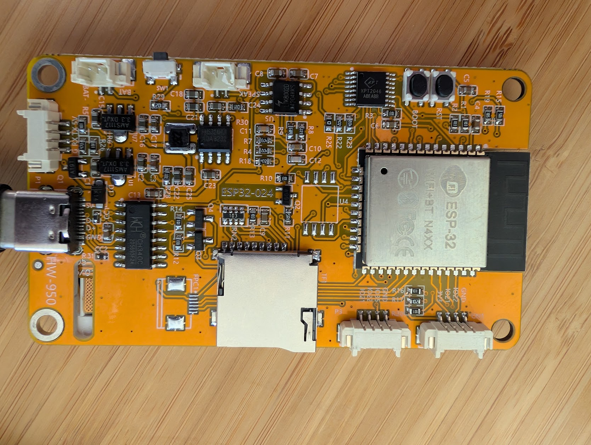
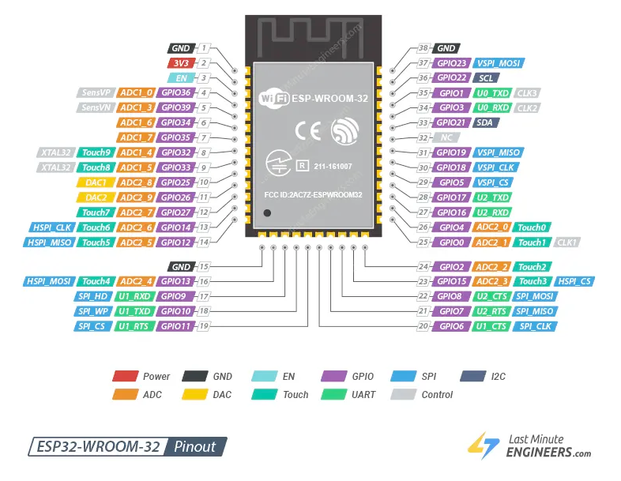

## ESP32-2432S024: The 2.4" version of CYD2USB (also called ESP32-2432S024)

WARNING: Not yet supported

FIXME once home with access to a multimeter to find where MISO is attached to
XPT2046.  Supposedly it is 39, but tried 12 and not there either.  Need to ohm it out. Until then both of the CYD boards are unsupported.  For the time being I'm leaving the test/debug code in touch.cpp.

### Hardware config

More pinout information here: https://github.com/F1ATB/ESP32-2432S028-2432S024-2432S032-JC2432W328

But in short: it should be mostly the [same](hardware.md) as the ESP32-028 except it uses a ILI9341 display controller.  Try to share as much as possible (via sym links or better directory structure) with the 028v3 variant.

> **Status: supported** (`BOARD=esp32_2432s024`, IDF target `esp32`). Builds
> green; on-hardware bring-up of colour/orientation/touch-calibration still
> pending. The whole CYD family now shares one C++ implementation in
> `firmware/boards/cyd_common/` (no symlinks); each board contributes only its
> `board_pins.h`, which selects the panel driver via
> `BOARD_LCD_CONTROLLER_ILI9341` (024) or `BOARD_LCD_CONTROLLER_ST7789` (028).

### Misc tips

Fix the Colors: The ST7789 panels used on the CYD2USB frequently have their color channels wired backward. If your UI renders with swapped colors (e.g., red appears blue), you must add this to your configuration header:
#define TFT_RGB_ORDER TFT_BGR

Inversion: If the screen looks like a film negative, flip the inversion flag:
#define TFT_INVERSION_ON (or OFF, depending on the default state).
