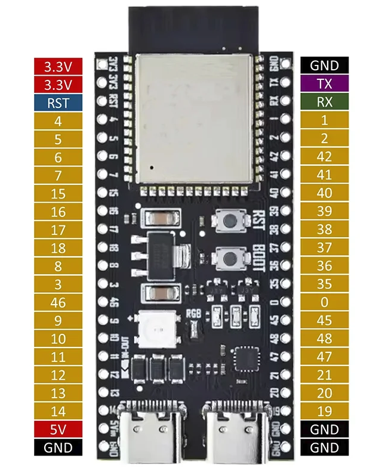
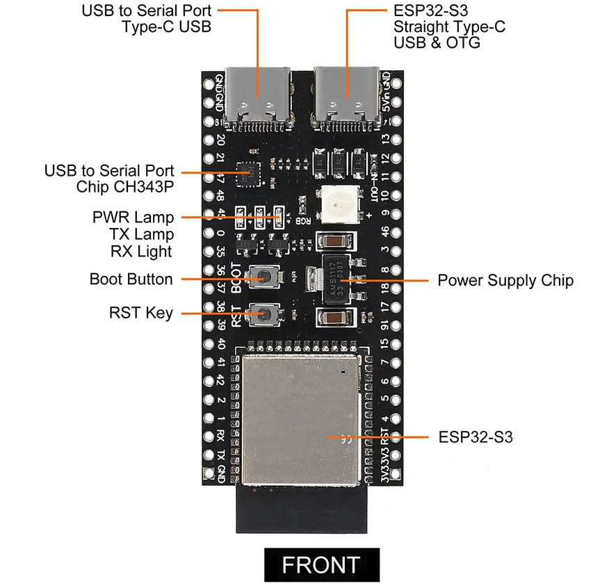

https://www.aliexpress.com/item/1005007520936918.html?spm=a2g0o.order_list.order_list_main.84.16b318026E6mD5&gatewayAdapt=4itemAdapt 

My version is based on a N16R8 (16MB FLASH 8MB RAM)

https://learn.adafruit.com/adafruit-esp32-s3-feather/overview 
https://forum.arduino.cc/t/esp32-s3-onboard-rgb-led/1198754/11?page=2

