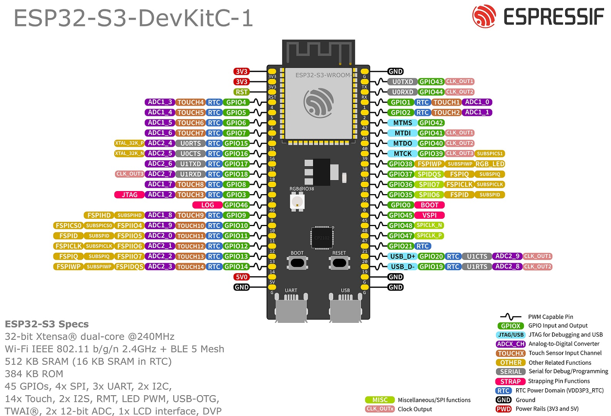

https://www.aliexpress.com/item/1005007520936918.html?spm=a2g0o.order_list.order_list_main.84.16b318026E6mD5&gatewayAdapt=4itemAdapt 

My version is based on a N16R8 (16MB FLASH 8MB RAM)

Based on this design: https://docs.espressif.com/projects/esp-dev-kits/en/latest/esp32s3/esp32-s3-devkitc-1/index.html

The onboard Neopixel is attached to GPIO 48.  On the aliexpress clone boards you typically need to bridge the small solder-bridge labeled "LED" to connect the led to the GPIO.  See the attached photos.

