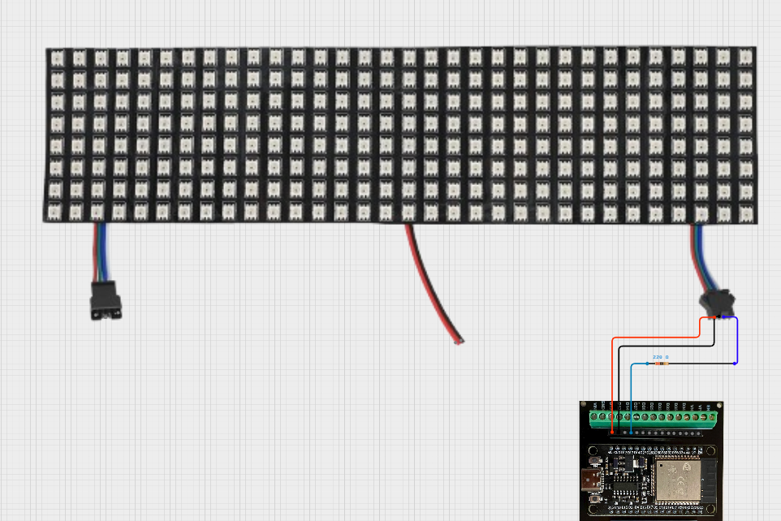
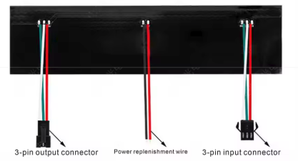
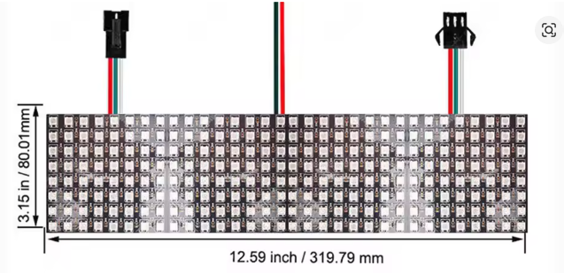

# lightbar

* Initially target ESP32-P4 processor (because of PARLIO support) but possibly others later
* Max of 4 bit lanes per box module, max of 4 modules (16 display panels - each panel 8x32 pixel).  Initially try just one lane per box module (4 displays daisy chained) and see how bad it is...
* 12V 200W in, internally use little 12V->buck converters to power the esp32 board and 5V device control
* include a small fan to help convection

## board: jc-esp32p4-m3

initial board will be jc-esp32p4-m3 (by Guition)

partial schematics here https://github.com/p1ngb4ck/unofficial_guition_esp32p4_repo/tree/main/JC-ESP32P4-M3-Dev. GPIO assignments https://github.com/microrobotics/JC-ESP32P4-M3-DEV/blob/main/JC-ESP32P4-M3-DEV%20GPIO%20Pin%20definition.pdf 

### WS2812B 8x32 Matrix Layout and Sequence

An 8x32 WS2812B LED matrix uses a **zigzag (serpentine)** layout instead of a progressive scan. The physical data line begins at the top-left (Pixel 0), travels to the right until the end of the row, and then "snakes" down to the next row in reverse. The sequence alternates direction for every row. 

#### Matrix Layout Sequence

* **Row 0 (Top):** Left-to-right (Pixel 0 to 31)
* **Row 1:** Right-to-left (Pixel 32 to 63)
* **Row 2:** Left-to-right (Pixel 64 to 95)
* **Row 3:** Right-to-left (Pixel 96 to 127)
* **Row 4:** Left-to-right (Pixel 128 to 159)
* **Row 5:** Right-to-left (Pixel 160 to 191)
* **Row 6:** Left-to-right (Pixel 192 to 223)
* **Row 7 (Bottom):** Right-to-left (Pixel 224 to 255)

#### How to Define the Matrix in Code

**FastLED Example:**
```cpp
CRGB leds[256];
FastLED.addLeds<WS2812B, DATA_PIN, GRB>(leds, 256);

int getPixelIndex(int x, int y) {
  if (y % 2 == 0) {
    return (y * 32) + x;
  } else {
    return (y * 32) + (31 - x);
  }
}
```
### rejected ideas
probably use spi https://github.com/okhsunrog/esp_ws28xx at first

https://github.com/Xylopyrographer/LiteLED - high perf esp driver
https://cdn-shop.adafruit.com/datasheets/WS2812B.pdf 
https://www.superlightingled.com/PDF/Addressable-Flex-LED-Pixel-Panel.pdf
https://github.com/AaronLiddiment/LEDText/wiki
https://docs.soldered.com/ws2812b/how-it-works/ 

https://github.com/fastled/fastled#-documentation--support
https://github.com/FastLED/FastLED/blob/master/src/platforms/esp/32/drivers/parlio/README.md 

smaller less popular lib https://github.com/Xylopyrographer/LiteLED 
how to use arduino libs https://docs.espressif.com/projects/arduino-esp32/en/latest/esp-idf_component.html 
possibly use https://github.com/FastLED/FastLED#fastled-3103-esp32-p4-rgb-lcd-driver-experimental
pioarduino is a platformio fork https://www.reddit.com/r/esp32/comments/1oj9spw/platformio_ide_vs_pioarduino_ide/

### misc notes

* Tips on LVGL multiple displays and notifying lvgl of activity: https://lvgl.io/docs/open/8.4/overview/display#features-of-displays


## Similar projects?

https://kno.wled.ge/features/effects/

## Firmware OTA
https://github.com/gibz104/SafeGithubOTA

## BOM

* https://www.aliexpress.us/item/3256802721579904.html 12V, 250W, $66

### Box module
design as an extendable platform.

4 of these panels, total cost $60 https://www.aliexpress.us/item/3256809608935627.html

female connector is upstream towards CPU




**Size of the Box**
To fit four 80x320mm panels edge-to-edge, your box will be a rectangular pillar measuring roughly **80mm x 80mm x 320mm**.

**Current Consumption**
You just escalated from a cute desk toy to a blinding space heater. 205W

* One 8x32 panel contains 256 LEDs.
* Four panels equal 1,024 LEDs total.

You **absolutely need 12V** (like the WS2815) for a project this dense.

Pushing 60 Amps at 5V means wrestling with massive wires. Furthermore, 5V suffers from severe voltage drop, which will turn your crisp white animations into a muddy orange unless you inject power constantly.

Switching to a 12V WS2815 matrix solves this. The higher voltage allows each pixel to draw only about 15mA at full white. Your 1,024 LED array now pulls a much more manageable **15.3 Amps**. It is a lot easier to wire, and significantly less likely to melt your desk.

### esp32 selection

https://github.com/espressif/esp-idf/issues/18071 says PARLIO based approaches (see below) are probably fine on any supporting arch.  Therefore probably a ESP32-P4 + ESP32-C6 (to get wifi) module is best.  This one: https://www.aliexpress.us/item/3256810578584433.html

### frame rate
For a single, continuous chain of 1,024 WS2815 (or WS2812B) LEDs, your maximum theoretical framerate is **~32.2 FPS**.

Here is the exact math behind that hardware limit:

1. **Bit Time:** The WS2815 protocol runs at 800 kHz. This means transmitting a single bit of data takes **1.25 microseconds (µs)**.
2. **LED Time:** Each LED requires 24 bits of color data (8 bits each for Red, Green, and Blue). So, one LED takes `24 * 1.25 µs =` **30 µs**.
3. **Transmission Time:** For 1,024 LEDs, the MCU must push data continuously for `1024 * 30 µs =` **30,720 µs (or 30.72 milliseconds)**.
4. **The Reset Latch:** Once the data is pushed, the data line must be held low for the LEDs to "latch" the data and display it. For modern WS2815/WS2812B chips, this reset pulse requires a minimum of **280 µs (0.28 ms)**.

**Total Frame Time:** `30.72 ms + 0.28 ms =` **31.00 ms per frame.**
**Max FPS:** `1000 ms / 31.00 ms =` **32.25 FPS.**

This is exactly why the ESP32-P4 and PARLIO hardware we discussed earlier are so powerful. By splitting those 1,024 LEDs across four independent pins (256 LEDs per pin) and transmitting them in parallel, your transmission time drops to 7.68 ms, pushing your maximum framerate up to an absolutely blistering **125 FPS**.

### esp32 drivers

ai sez

Yes, absolutely. The ESP32 ecosystem has heavily embraced hardware-driven DMA (Direct Memory Access) solutions for WS2812B LEDs to solve the notorious "flickering" issues caused by FreeRTOS task switching, Wi-Fi, and Bluetooth interrupts.

Because the WS2812B requires incredibly strict microsecond timing, "bit-banging" (using the CPU to toggle pins) falls apart as soon as the ESP32 tries to process a network packet. To get around this, developers have written drivers that hijack various hardware peripherals to stream the data via DMA without CPU intervention.

Here are the main hardware DMA methods and the libraries that support them:

### 1. I2S / LCD Parallel Mode (The Powerhouse)

One of the most brilliant and widely used methods in the community is repurposing the ESP32's I2S (audio) peripheral. At its core, I2S flips a data line really fast alongside a clock. Developers figured out how to feed WS2812 data into the I2S hardware instead of sound.

* **Why it's great:** It uses DMA, meaning zero CPU overhead during transmission, and the CPU is free to calculate the next frame while the current one is drawing. It can also drive up to 24 separate LED strips simultaneously in parallel on a standard ESP32, and utilizes the LCD Parallel driver on the ESP32-S3.
* **Where to find it:** Supported by **FastLED** (by enabling the `FASTLED_ESP32_I2S` build flag) and **NeoPixelBus**.

### 2. RMT with DMA (The Modern Standard)

The RMT (Remote Control Transceiver) peripheral was designed by Espressif specifically to generate arbitrary waveforms like infrared signals. For a long time, RMT was interrupt-driven, which still suffered from Wi-Fi stuttering. However, modern ESP-IDF versions (v5+) and modern ESP32 chips now allow the RMT hardware to be assisted by DMA.

* **Why it's great:** It allows asynchronous, DMA-backed transmissions, and the hardware is specifically tailored for exact pulse widths.
* **Where to find it:** The official **ESP-IDF `led_strip**` component (by setting `with_dma` to true in the config) and the latest versions of **FastLED**.

### 3. SPI with DMA (The Reliable Fallback)

The SPI peripheral can be tricked into generating the WS2812 timing by clocking the bus extremely fast (e.g., 2.4MHz) and packing multiple SPI bits to represent a single WS2812 high/low pulse.

* **Why it's great:** SPI naturally uses DMA, making it rock-solid against interrupts. It is highly recommended if your chip doesn't have RMT DMA support.
* **Where to find it:** Supported natively in the **ESP-IDF `led_strip**` component (using the SPI backend) and in FastLED via the `FASTLED_ESP32_USE_CLOCKLESS_SPI` flag.

### 4. PARLIO with DMA (For the Newest Chips)

On the newest generations of ESP32 chips (like the ESP32-C6, ESP32-H2, and ESP32-P4), a new peripheral called PARLIO (Parallel IO) is used.

* **Why it's great:** It allows you to register up to 16 strips on independent bit-lanes, where all displays are updated in a single DMA transfer in perfect lock-step synchronization.
* **Where to find it:** The **LiteLED** library provides a specific `LiteLEDpioGroup` class to utilize this hardware on Arduino-ESP32 setups.

### Which Library Should You Use?

* **For WLED/Smart Home:** Use **NeoPixelBus**. It is the underlying engine for WLED and handles I2S DMA automatically to keep the web-server perfectly responsive.
* **For Custom Arduino Code:** Use **FastLED**. It is the gold standard for animations. It defaults to an asynchronous RMT DMA driver on modern frameworks, but you can force I2S for parallel output.
* **For Bare-Metal ESP-IDF:** Use Espressif's official **`led_strip`** component. It abstracts the hardware details so you just pass in your backend of choice (RMT or SPI) and it handles the memory allocation and DMA.
